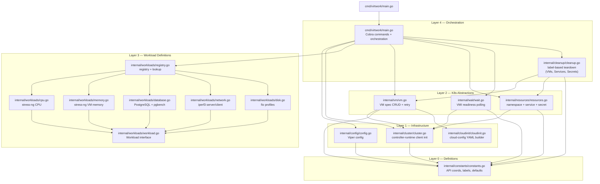
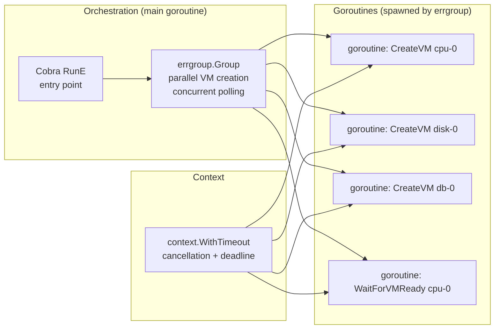
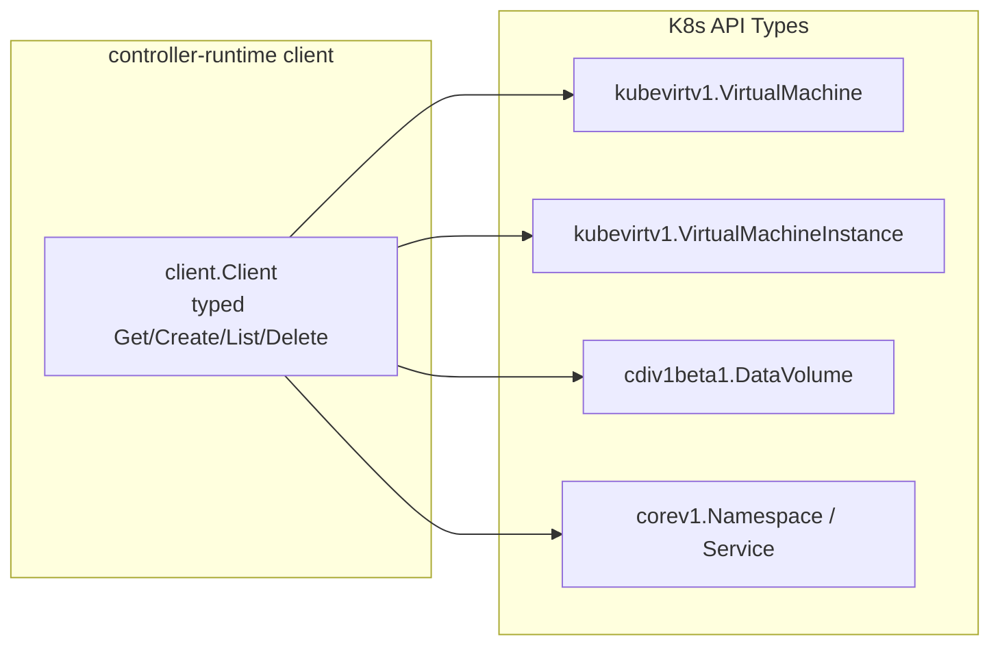
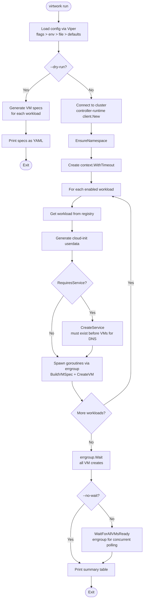
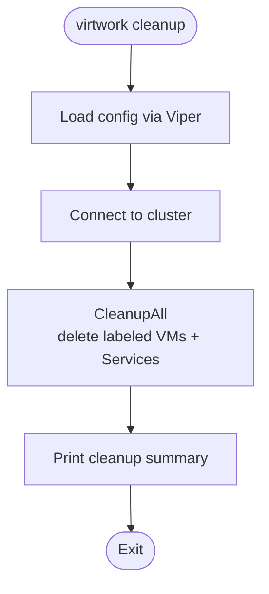
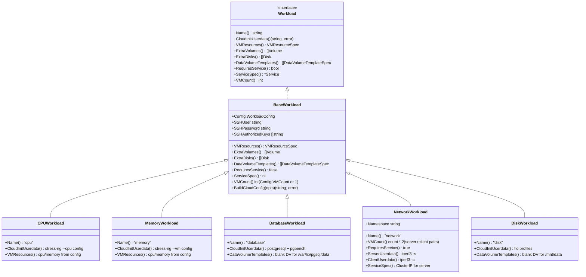
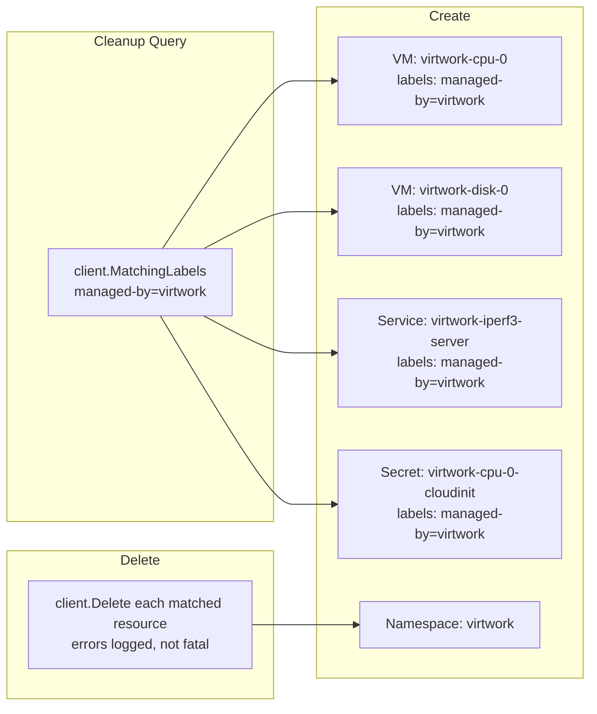
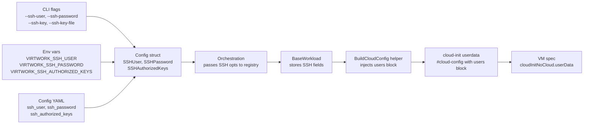
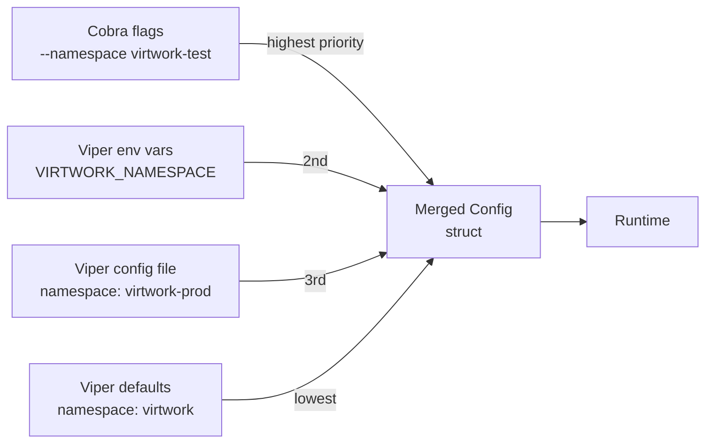

# Virtwork Architecture

## Overview

Virtwork is a CLI tool that creates virtual machines on OpenShift clusters (with OpenShift Virtualization / CNV installed) and runs continuous workloads inside them. The goal is to produce realistic CPU, memory, database, network, and disk I/O metrics for monitoring systems (Prometheus, Grafana).

It is a **one-shot deployment tool** — it creates resources and exits. Workload lifecycle management is delegated to systemd inside each VM.

---

## Layered Architecture

The codebase is organized into five dependency layers. Each layer depends only on layers below it.



---

## Concurrency Model

Go's native concurrency eliminates the need for async/sync bridging. All I/O operations run naturally in goroutines, coordinated by `errgroup` and controlled by `context.Context`.





| Package | Goroutines | Rationale |
|---------|-----------|-----------|
| `internal/constants` | No | Pure values, no I/O |
| `internal/config` | No | One-time Viper load at startup |
| `internal/cloudinit` | No | Pure string/YAML generation |
| `internal/cluster` | No | One-time client init at startup |
| `internal/vm` | Yes | CRUD operations run in errgroup goroutines; retry loops use `time.Sleep` |
| `internal/resources` | Yes | Namespace/Service/Secret creation can run concurrently |
| `internal/wait` | Yes | Concurrent VMI polling via errgroup; uses `time.Sleep` between polls |
| `internal/workloads` | No | Pure data producers (cloud-init specs, resource structs) |
| `internal/cleanup` | No | Sequential VM/Service/Secret deletion with error accumulation |
| `cmd/virtwork` | Yes | Owns errgroup lifecycle; spawns goroutines for parallel operations |

---

## CLI Orchestration Flow





---

## Workload Architecture

Each workload implements the `Workload` interface and produces cloud-init userdata and VM resource requirements. Workloads do not perform any I/O — they are pure data producers.



`BaseWorkload` is an embedded struct that provides default implementations for optional interface methods. Concrete workloads embed `BaseWorkload` and override only the methods they need — idiomatic Go composition over inheritance.

`BaseWorkload` also stores SSH credential fields and exposes a `BuildCloudConfig(opts)` helper method that injects SSH user/password/keys into the cloud-init output. Workload subclasses call `w.BuildCloudConfig(opts)` instead of `cloudinit.BuildCloudConfig(opts)` directly, keeping SSH injection as a single cross-cutting concern on the base struct.

### Workload Comparison

| Workload | VM Count | Data Volume | K8s Service | Packages | Workload Tool |
|----------|----------|-------------|-------------|----------|---------------|
| CPU | N (configurable) | No | No | stress-ng | `stress-ng --cpu 0 --cpu-method all` |
| Memory | N (configurable) | No | No | stress-ng | `stress-ng --vm 1 --vm-bytes 80% --vm-method all` |
| Database | N (configurable) | Yes (`/var/lib/pgsql/data`) | No | postgresql-server | `pgbench -c 10 -j 2 -T 300` loop |
| Network | N×2 (server + client pairs) | No | Yes (ClusterIP) | iperf3 | `iperf3 -s` / `iperf3 -c ... --bidir` |
| Disk | N (configurable) | Yes (`/mnt/data`) | No | fio | Mixed R/W + sequential write profiles |

---

## Resource Tracking and Cleanup

All created resources are labeled with `app.kubernetes.io/managed-by: virtwork`. Cleanup queries by label selector — no state file needed. This is resilient to crashes (works even if the tool terminated mid-creation).



---

## SSH Credential Flow

SSH credentials are a cross-cutting concern that flows through every layer:



List fields (`SSHAuthorizedKeys`) require special handling at each config layer: YAML passes lists directly, environment variables use comma separation, and CLI merges values from both `--ssh-key` (inline) and `--ssh-key-file` (file path) flags.

---

## Configuration Priority Chain



Viper's built-in priority chain handles this natively when bound to Cobra flags:
1. Cobra flag explicitly set by user
2. Environment variable (`VIRTWORK_` prefix, automatic binding)
3. Config file (YAML, loaded via `viper.ReadInConfig()`)
4. Default value (set via `viper.SetDefault()`)

---

## Key Design Decisions

| Decision | Choice | Rationale |
|----------|--------|-----------|
| Boot disk | `containerDisk` | Fast kubelet image pull, cached on nodes. Ephemeral root is fine for workload VMs. |
| Data disk | Blank `DataVolume` | Formatted on first boot by cloud-init. Only needed for database and fio workloads. |
| Workload lifecycle | systemd services | Survive reboots, auto-restart on failure, proper logging via journald. |
| Network coordination | K8s Service + DNS | No IP polling from Go. Client retries via systemd `Restart=always`. |
| Cleanup tracking | Label selectors | No state file. Works even if tool crashed mid-creation. |
| Auth | In-cluster first, kubeconfig fallback | Works both inside pods (CI/CD) and from developer machines. |
| Concurrency | goroutines + `errgroup` | Native Go concurrency with structured error collection. No async/sync bridge needed. |
| K8s client | controller-runtime `client.Client` | Typed CRUD operations. Scheme-based serialization for KubeVirt/CDI types. Common in OpenShift ecosystem. |
| Idempotency | AlreadyExists = skip | Safe to re-run. Enables declarative approach. |
| Retry | Backoff for rate-limited/5xx | Handles transient cluster issues. NotFound/Unauthorized/Forbidden are fatal (configuration errors). |
| SSH credential injection | `BaseWorkload.BuildCloudConfig()` helper | Cross-cutting concern handled once in base struct. Workloads call one method. |
| Multi-VM orchestration | `MultiVMWorkload` interface + `VMCount() > 1` | Generic detection — future multi-VM workloads work without orchestration changes. |
| Network VM scaling | `VMCount() = count * 2` | Honors `--vm-count` to create N server/client pairs instead of a single hardcoded pair. |
| Cloud-init Secrets | `CloudInitSecretName` → `UserDataSecretRef` | For large userdata, stores cloud-init in a K8s Secret instead of inline in the VM spec. |
| Cleanup error semantics | Sequential per-resource deletion with error accumulation | Different from create-time error handling (which is fail-fast). Cleanup continues on individual failures. |

---

## Project Structure

```
virtwork/
├── cmd/
│   └── virtwork/
│       └── main.go                # Cobra root + subcommands, orchestration
├── internal/
│   ├── constants/
│   │   └── constants.go           # API coords, labels, defaults
│   ├── config/
│   │   └── config.go              # Config struct, Viper priority chain
│   ├── cluster/
│   │   └── cluster.go             # controller-runtime client init + scheme registration
│   ├── cloudinit/
│   │   └── cloudinit.go           # Cloud-config YAML builder
│   ├── vm/
│   │   └── vm.go                  # VM spec construction + typed CRUD + retry
│   ├── resources/
│   │   └── resources.go           # Namespace + Service + Secret helpers
│   ├── wait/
│   │   └── wait.go                # VMI readiness polling (errgroup)
│   ├── cleanup/
│   │   └── cleanup.go             # Label-based teardown (VMs, Services, Secrets)
│   ├── workloads/
│   │   ├── workload.go            # Workload interface + BaseWorkload
│   │   ├── registry.go            # Registry map + lookup
│   │   ├── cpu.go                 # stress-ng CPU continuous workload
│   │   ├── memory.go              # stress-ng VM memory pressure workload
│   │   ├── database.go            # PostgreSQL + pgbench loop
│   │   ├── network.go             # iperf3 server/client pair
│   │   └── disk.go                # fio mixed I/O profiles
│   └── testutil/
│       ├── testutil.go            # Shared test helpers (namespace, connect, cleanup)
│       └── binary.go              # Binary build/run helpers for E2E
├── tests/
│   └── e2e/                       # E2E acceptance tests (//go:build e2e)
├── docs/
│   ├── architecture.md            # This file
│   ├── development.md             # Developer guide
│   ├── implementation-plan.md     # Phased build plan
│   ├── openshift-virtualization-workload-automation.md  # Design plan
│   └── engineering-journals/      # Per-phase development journals
├── go.mod
├── go.sum
└── CLAUDE.md
```
