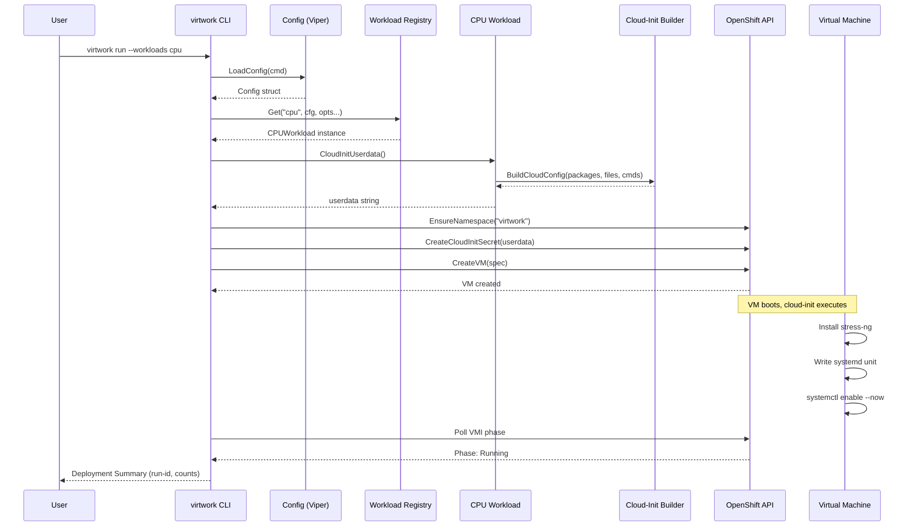
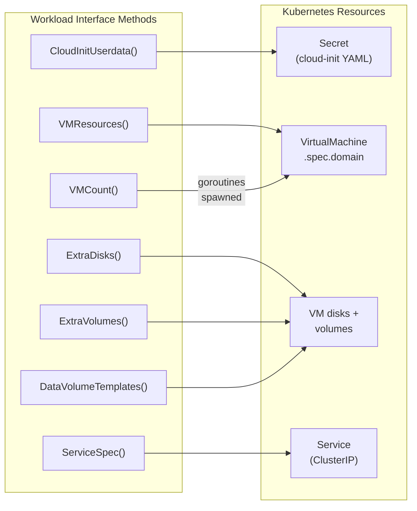

# How Virtwork Works

Virtwork is a one-shot deployment tool. You run it, it creates virtual machines on your OpenShift cluster, and then it exits. There is no long-running controller, no reconciliation loop, and no custom resource definitions. The workloads inside the VMs are managed by systemd, so they survive reboots, auto-restart on failure, and keep producing metrics long after virtwork has finished its job.

The VMs run continuous stress workloads — CPU, memory, database, network, and disk I/O — that produce realistic metrics for monitoring systems like Prometheus and Grafana. This makes virtwork useful for testing monitoring pipelines, validating alert rules, and stress-testing cluster capacity.

## The Lifecycle of a Workload VM

Let's trace what happens when you type:

```bash
virtwork run --workloads cpu --vm-count 1
```

### 1. Configuration Loads

Virtwork uses [Viper](https://github.com/spf13/viper) to merge configuration from four sources, highest priority first:

1. CLI flags (`--workloads cpu`)
2. Environment variables (`VIRTWORK_NAMESPACE`, etc.)
3. YAML config file (if `--config` was passed)
4. Built-in defaults (namespace `virtwork`, 2 CPU cores, `2Gi` memory, etc.)

The result is a single `Config` struct that every downstream component reads. See the [README configuration section](../../README.md#configuration) for the full priority chain and available options.

### 2. The Workload Registry Resolves Your Request

The string `"cpu"` needs to become executable code. Virtwork maintains a **registry** — a map from workload names to factory functions:

```go
registry := workloads.DefaultRegistry()
// registry["cpu"] → func(cfg, opts) → NewCPUWorkload(...)
// registry["memory"] → func(cfg, opts) → NewMemoryWorkload(...)
// ...
```

When the orchestrator calls `registry.Get("cpu", cfg, opts...)`, it:
1. Looks up the factory function for `"cpu"`
2. Applies functional options (namespace, SSH credentials, disk size)
3. Returns a `Workload` instance — a **pure data producer** with no I/O

### 3. Cloud-Init Is Generated

Each workload knows what software it needs and how to run it. The CPU workload generates this cloud-init YAML:

```yaml
#cloud-config
packages:
  - stress-ng
write_files:
  - path: /etc/systemd/system/virtwork-cpu.service
    content: |
      [Unit]
      Description=Virtwork CPU stress workload
      After=network.target

      [Service]
      Type=simple
      ExecStart=/usr/bin/stress-ng --cpu 0 --cpu-method all --timeout 0
      Restart=always
      RestartSec=10

      [Install]
      WantedBy=multi-user.target
    permissions: '0644'
runcmd:
  - - systemctl
    - daemon-reload
  - - systemctl
    - enable
    - --now
    - virtwork-cpu.service
```

This is a standard [cloud-init](https://cloudinit.readthedocs.io/) configuration. When the VM boots, cloud-init will install `stress-ng` from the package manager, write the systemd unit file, and enable the service. The workload starts automatically.

If SSH credentials were configured, a `users` section is appended with the SSH public keys and/or password.

### 4. The VM Spec Is Constructed

The orchestrator takes the cloud-init YAML and combines it with the workload's resource requirements to build a KubeVirt `VirtualMachine` object. The key pieces:

- **containerDisk** — The OS image (`quay.io/containerdisks/fedora:41` by default), pulled from a container registry. This is a read-only disk that provides the base operating system.
- **cloudInitNoCloud** — The cloud-init YAML from step 3, stored as a Kubernetes Secret and referenced by the VM spec.
- **CPU and memory** — Set as resource requests on the VM's domain spec (default: 2 cores, 2Gi).
- **Labels** — Every resource gets `app.kubernetes.io/managed-by: virtwork` and a unique `virtwork/run-id` UUID. These labels are how cleanup finds resources later.
- **Extra disks** — Some workloads (database, disk) add persistent data volumes via CDI DataVolumeTemplates.

### 5. Resources Are Created on the Cluster

The orchestrator creates Kubernetes resources in a specific order:

1. **Namespace** — Ensured first (idempotent; no error if it exists)
2. **Services** — Created before VMs so DNS resolves when client VMs boot (only the network workload needs this)
3. **Cloud-init Secrets** — One per VM, containing the cloud-init YAML
4. **VMs** — Created concurrently via `errgroup`, one goroutine per VM

Each resource gets the `virtwork/run-id` label linking it to this specific execution. If virtwork crashes mid-deployment, cleanup can still find and delete everything by label.

### 6. Inside the VM

Once the VM is created, KubeVirt boots it and cloud-init takes over:

1. Cloud-init installs packages (`stress-ng` for CPU, `fio` for disk, `postgresql-server` for database, etc.)
2. Cloud-init writes files (systemd unit definitions, fio job profiles, setup scripts)
3. Cloud-init runs commands (`systemctl daemon-reload`, `systemctl enable --now ...`)
4. The systemd service starts the workload

From this point forward, the workload runs independently. Systemd ensures:
- If the process crashes, it restarts after 10 seconds (`RestartSec=10`)
- If the VM reboots, the service starts on boot (`WantedBy=multi-user.target`)
- The workload runs until the VM is deleted

### 7. Readiness Polling

After creating all VMs, virtwork polls each `VirtualMachineInstance` (VMI) to confirm it reached the `Running` phase. This happens concurrently — one goroutine per VM — with a configurable timeout (default: 10 minutes, adjustable via `--timeout`).

Once all VMs are running, virtwork prints a deployment summary and exits:

```
==================================================
Deployment Summary
==================================================
Run ID:       a1b2c3d4-e5f6-7890-abcd-ef0123456789
Namespace:    virtwork
VMs created:  1
Services:     0
Secrets:      1
Image:        quay.io/containerdisks/fedora:41
==================================================
```

The run ID is your handle for targeted cleanup later.



## The Workload Interface

Every workload in virtwork implements the same interface. Think of it as a recipe card — the orchestrator asks each workload a series of questions, and the answers determine what gets created on the cluster.

```go
type Workload interface {
    Name() string                                          // "What's your name?"
    CloudInitUserdata() (string, error)                    // "What should run inside the VM?"
    VMResources() VMResourceSpec                           // "How many CPU cores and memory?"
    ExtraVolumes() []kubevirtv1.Volume                     // "Do you need extra volumes?"
    ExtraDisks() []kubevirtv1.Disk                         // "Do you need extra disks?"
    DataVolumeTemplates() []kubevirtv1.DataVolumeTemplateSpec // "Do you need persistent storage?"
    RequiresService() bool                                 // "Do you need a K8s Service?"
    ServiceSpec() *corev1.Service                          // "What should that Service look like?"
    VMCount() int                                          // "How many VMs do you need?"
}
```

The orchestrator never knows (or cares) what software runs inside each VM. It just calls these methods, gets back data, and creates the corresponding Kubernetes resources.

### BaseWorkload: Sensible Defaults

Most workloads don't need extra disks, services, or multiple VMs. The `BaseWorkload` struct provides default implementations that return "no" for all optional questions:

```go
type BaseWorkload struct {
    Config            config.WorkloadConfig
    SSHUser           string
    SSHPassword       string
    SSHAuthorizedKeys []string
}

func (b *BaseWorkload) ExtraVolumes() []kubevirtv1.Volume { return nil }
func (b *BaseWorkload) ExtraDisks() []kubevirtv1.Disk     { return nil }
func (b *BaseWorkload) RequiresService() bool              { return false }
// ... etc
```

Concrete workloads embed `BaseWorkload` and only override what they need. This creates a natural complexity spectrum:

| Workload | Overrides Beyond Name + CloudInit | Complexity |
|----------|-----------------------------------|------------|
| **CPU** | Nothing | Simplest |
| **Memory** | Nothing | Simplest |
| **Database** | `DataVolumeTemplates`, `ExtraDisks`, `ExtraVolumes` | Medium |
| **Disk** | `DataVolumeTemplates`, `ExtraDisks`, `ExtraVolumes` | Medium |
| **Network** | `VMCount`, `RequiresService`, `ServiceSpec`, plus `MultiVMWorkload` interface | Most complex |

The network workload is the most involved — it creates two VMs per configured count (a server and a client), needs a Kubernetes Service for DNS routing between them, and generates different cloud-init YAML for each role.



## The Deploy-and-Exit Model

Virtwork is deliberately **not** a Kubernetes operator. There is no reconciliation loop, no CRDs, and no watches. This design choice has several implications:

- **Resources are tracked by labels**, not by a state file or database. Every resource gets `app.kubernetes.io/managed-by: virtwork` and `virtwork/run-id: <uuid>`. Cleanup queries these labels to find what to delete.
- **Cleanup works even after crashes.** If virtwork dies mid-deployment, the label selectors still find all resources that were created. No orphaned state.
- **The audit database is optional.** It records what happened and when, but it's not required for cleanup to work. You can disable it with `--no-audit` and cleanup still functions.
- **Workload lifecycle is delegated to systemd.** Virtwork doesn't monitor the workloads after deployment. The systemd units handle restarts, and the workloads run until the VMs are deleted.

## Finding Your Way Around the Code

If you want to dig deeper into how each component works:

| I want to understand... | Look at... |
|------------------------|------------|
| How workloads define themselves | `internal/workloads/` — interface in `workload.go`, implementations in `cpu.go`, `memory.go`, etc. |
| How VMs are built from workload data | `internal/vm/vm.go` — `BuildVMSpec()` and `CreateVM()` |
| The CLI orchestration flow | `cmd/virtwork/main.go` — `runE()` and `cleanupE()` |
| Configuration loading | `internal/config/config.go` — `LoadConfig()` with Viper |
| Cloud-init YAML generation | `internal/cloudinit/cloudinit.go` — `BuildCloudConfig()` |
| Resource helpers (namespace, service, secret) | `internal/resources/resources.go` |
| VM readiness polling | `internal/wait/wait.go` — concurrent VMI phase polling |
| Cleanup by label selector | `internal/cleanup/cleanup.go` — `CleanupAll()` |
| Audit logging | `internal/audit/` — `Auditor` interface, SQLite schema, records |
| Constants and defaults | `internal/constants/constants.go` |

For the full layered architecture with dependency diagrams, see [docs/architecture.md](../architecture.md).
