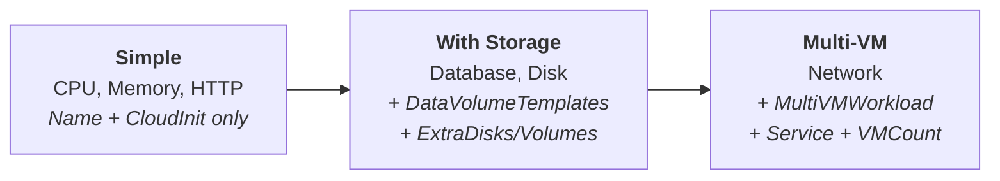

# Tutorial: Building an HTTP Workload

This tutorial walks through adding a new workload type to virtwork from scratch using TDD. By the end, you'll have a working `http` workload that deploys nginx and runs continuous HTTP benchmarks inside a VM.

## What We're Building

An "http" workload that:

- Installs **nginx** (web server) and **httpd-tools** (provides `ab`, the Apache Bench HTTP benchmarking tool)
- Configures nginx to serve a default page on localhost
- Runs `ab` in a loop, generating continuous HTTP request/response metrics
- Runs on a single VM with no extra disks and no Kubernetes Service

This is a good first workload because it exercises the core `Workload` interface without the added complexity of data volumes (like `database` and `disk`) or multi-VM orchestration (like `network`).

## Before You Start

- Go 1.25+ installed
- Ginkgo CLI installed: `go install github.com/onsi/ginkgo/v2/ginkgo@latest`
- Read [How Virtwork Works](01-overview.md) to understand the workload interface
- See [docs/development.md](../development.md) for environment setup

## Step 1: Plan the Cloud-Init

Before writing any Go code, design what will happen inside the VM on first boot.

### Packages

- `nginx` — Available in Fedora repos. Serves HTTP on localhost.
- `httpd-tools` — Available in Fedora repos. Provides `ab` (Apache Bench), a standard HTTP benchmarking tool.

We're choosing `ab` over tools like `wrk` or `hey` because `httpd-tools` is in Fedora's default repos — no custom builds or third-party repos needed. This follows the existing pattern: `stress-ng`, `fio`, `iperf3`, and `postgresql-server` are all standard repo packages.

### Systemd unit

The workload service depends on nginx being started first, then runs `ab` in an infinite loop:

```ini
[Unit]
Description=Virtwork HTTP benchmark workload
After=nginx.service
Requires=nginx.service

[Service]
Type=simple
ExecStart=/bin/bash -c 'while true; do ab -n 10000 -c 10 http://localhost/; sleep 5; done'
Restart=always
RestartSec=10

[Install]
WantedBy=multi-user.target
```

This runs 10,000 requests with 10 concurrent connections per batch, sleeps 5 seconds, and repeats. The `Requires=nginx.service` ensures nginx is running before the benchmark starts.

### Cloud-init plan

```yaml
#cloud-config
packages:
  - nginx
  - httpd-tools
write_files:
  - path: /etc/systemd/system/virtwork-http.service
    content: |
      [Unit]
      Description=Virtwork HTTP benchmark workload
      ...
    permissions: '0644'
runcmd:
  - [systemctl, daemon-reload]
  - [systemctl, enable, --now, nginx]
  - [systemctl, enable, --now, virtwork-http.service]
```

Note that we enable nginx *before* the benchmark service, matching the `After=nginx.service` dependency.

## Step 2: Write the Tests First

Create the test file `internal/workloads/http_test.go`. We follow the same Ginkgo BDD structure used by the existing workload tests (see `cpu_test.go` for reference):

```go
// Copyright 2026 Red Hat
// SPDX-License-Identifier: Apache-2.0

package workloads_test

import (
	. "github.com/onsi/ginkgo/v2"
	. "github.com/onsi/gomega"

	"github.com/opdev/virtwork/internal/config"
	"github.com/opdev/virtwork/internal/workloads"
)

var _ = Describe("HTTPWorkload", func() {
	var w *workloads.HTTPWorkload

	BeforeEach(func() {
		w = workloads.NewHTTPWorkload(config.WorkloadConfig{
			Enabled:  true,
			VMCount:  1,
			CPUCores: 2,
			Memory:   "2Gi",
		}, "virtwork", "", nil)
	})

	It("should return 'http' for Name", func() {
		Expect(w.Name()).To(Equal("http"))
	})

	It("should include nginx and httpd-tools in packages", func() {
		result, err := w.CloudInitUserdata()
		Expect(err).NotTo(HaveOccurred())

		parsed := parseYAML(result)
		pkgs, ok := parsed["packages"].([]interface{})
		Expect(ok).To(BeTrue())
		Expect(pkgs).To(ContainElement("nginx"))
		Expect(pkgs).To(ContainElement("httpd-tools"))
	})

	It("should include systemd service in cloud-init", func() {
		result, err := w.CloudInitUserdata()
		Expect(err).NotTo(HaveOccurred())

		parsed := parseYAML(result)
		Expect(parsed).To(HaveKey("write_files"))
		files := parsed["write_files"].([]interface{})
		Expect(files).To(HaveLen(1))

		file := files[0].(map[string]interface{})
		Expect(file["path"]).To(Equal("/etc/systemd/system/virtwork-http.service"))

		content := file["content"].(string)
		Expect(content).To(ContainSubstring("ab"))
		Expect(content).To(ContainSubstring("http://localhost/"))
		Expect(content).To(ContainSubstring("Requires=nginx.service"))
	})

	It("should enable nginx before the benchmark service", func() {
		result, err := w.CloudInitUserdata()
		Expect(err).NotTo(HaveOccurred())

		parsed := parseYAML(result)
		cmds := parsed["runcmd"].([]interface{})
		Expect(len(cmds)).To(BeNumerically(">=", 3))
	})

	It("should produce valid YAML", func() {
		result, err := w.CloudInitUserdata()
		Expect(err).NotTo(HaveOccurred())
		Expect(result).To(HavePrefix("#cloud-config\n"))

		parsed := parseYAML(result)
		Expect(parsed).NotTo(BeNil())
	})

	It("should have no extra disks", func() {
		Expect(w.ExtraDisks()).To(BeNil())
	})

	It("should have no extra volumes", func() {
		Expect(w.ExtraVolumes()).To(BeNil())
	})

	It("should have no data volume templates", func() {
		Expect(w.DataVolumeTemplates()).To(BeNil())
	})

	It("should not require a service", func() {
		Expect(w.RequiresService()).To(BeFalse())
		Expect(w.ServiceSpec()).To(BeNil())
	})

	It("should return 1 for VMCount", func() {
		Expect(w.VMCount()).To(Equal(1))
	})

	It("should reflect config in VMResources", func() {
		res := w.VMResources()
		Expect(res.CPUCores).To(Equal(2))
		Expect(res.Memory).To(Equal("2Gi"))
	})

	It("should include SSH user when configured", func() {
		w = workloads.NewHTTPWorkload(config.WorkloadConfig{
			Enabled:  true,
			VMCount:  1,
			CPUCores: 2,
			Memory:   "2Gi",
		}, "testuser", "", []string{"ssh-ed25519 AAAA..."})

		result, err := w.CloudInitUserdata()
		Expect(err).NotTo(HaveOccurred())

		parsed := parseYAML(result)
		Expect(parsed).To(HaveKey("users"))
	})
})
```

The `parseYAML` helper is already available in `helpers_test.go` — it strips the `#cloud-config` prefix and unmarshals the YAML into a map.

### Run the tests

```bash
go test ./internal/workloads/...
```

This will fail with compilation errors because `HTTPWorkload` and `NewHTTPWorkload` don't exist yet. This is expected — we've confirmed the tests compile against the right interface and we know what we're building.

## Step 3: Create the Workload

Create the file `internal/workloads/http.go`. Follow the pattern established by `cpu.go`:

```go
// Copyright 2026 Red Hat
// SPDX-License-Identifier: Apache-2.0

package workloads

import (
	"github.com/opdev/virtwork/internal/config"
)

const httpBenchSystemdUnit = `[Unit]
Description=Virtwork HTTP benchmark workload
After=nginx.service
Requires=nginx.service

[Service]
Type=simple
ExecStart=/bin/bash -c 'while true; do ab -n 10000 -c 10 http://localhost/; sleep 5; done'
Restart=always
RestartSec=10

[Install]
WantedBy=multi-user.target
`

// HTTPWorkload generates cloud-init userdata for an HTTP benchmark workload
// using nginx and ab (Apache Bench).
type HTTPWorkload struct {
	BaseWorkload
}

// NewHTTPWorkload creates an HTTPWorkload with the given configuration and SSH credentials.
func NewHTTPWorkload(cfg config.WorkloadConfig, sshUser, sshPassword string, sshKeys []string) *HTTPWorkload {
	return &HTTPWorkload{
		BaseWorkload: BaseWorkload{
			Config:            cfg,
			SSHUser:           sshUser,
			SSHPassword:       sshPassword,
			SSHAuthorizedKeys: sshKeys,
		},
	}
}

// Name returns "http".
func (w *HTTPWorkload) Name() string {
	return "http"
}

// CloudInitUserdata returns cloud-init YAML that installs nginx and httpd-tools,
// then runs a continuous HTTP benchmark via systemd.
func (w *HTTPWorkload) CloudInitUserdata() (string, error) {
	return w.BuildCloudConfig(CloudConfigOpts{
		Packages: []string{"nginx", "httpd-tools"},
		WriteFiles: []WriteFile{
			{
				Path:        "/etc/systemd/system/virtwork-http.service",
				Content:     httpBenchSystemdUnit,
				Permissions: "0644",
			},
		},
		RunCmd: [][]string{
			{"systemctl", "daemon-reload"},
			{"systemctl", "enable", "--now", "nginx"},
			{"systemctl", "enable", "--now", "virtwork-http.service"},
		},
	})
}
```

Let's walk through the key decisions:

**Embedding `BaseWorkload`** — We inherit default implementations for `VMResources()`, `ExtraDisks()`, `ExtraVolumes()`, `DataVolumeTemplates()`, `RequiresService()`, `ServiceSpec()`, and `VMCount()`. Since an HTTP workload doesn't need extra disks, services, or multiple VMs, the defaults are all correct.

**Constructor signature** — `NewHTTPWorkload(cfg, sshUser, sshPassword, sshKeys)` matches the same pattern as every other workload constructor. This is required by the registry's `WorkloadFactory` type.

**Using `w.BuildCloudConfig()`** — This is the `BaseWorkload` method, not `cloudinit.BuildCloudConfig()`. The difference matters: `BuildCloudConfig()` injects the SSH credentials before calling the cloudinit package. Always use the method, not the package function.

**Three runcmds** — We enable nginx separately from the benchmark service, and `daemon-reload` comes first to pick up the new unit file.

### Run the tests again

```bash
go test ./internal/workloads/...
```

All `HTTPWorkload` tests should pass, and existing workload tests remain green.

## Step 4: Register the Workload

The workload exists but the CLI doesn't know about it yet. Two changes are needed in `internal/workloads/registry.go`.

### Add to AllWorkloadNames

```go
// Before:
var AllWorkloadNames = []string{"cpu", "database", "disk", "memory", "network"}

// After:
var AllWorkloadNames = []string{"cpu", "database", "disk", "http", "memory", "network"}
```

Keep the list alphabetically sorted.

### Add the factory to DefaultRegistry

```go
func DefaultRegistry() Registry {
	return Registry{
		"cpu": func(cfg config.WorkloadConfig, opts *RegistryOpts) Workload {
			return NewCPUWorkload(cfg, opts.SSHUser, opts.SSHPassword, opts.SSHAuthorizedKeys)
		},
		// ... existing entries ...
		"http": func(cfg config.WorkloadConfig, opts *RegistryOpts) Workload {
			return NewHTTPWorkload(cfg, opts.SSHUser, opts.SSHPassword, opts.SSHAuthorizedKeys)
		},
		// ... existing entries ...
	}
}
```

### Update affected tests

Adding a workload to the registry changes two things that existing tests verify:

1. **Registry tests** — The count of registered workloads increases from 5 to 6, and `List()` returns a different slice.
2. **Orchestration tests** — If the default `--workloads` flag includes all workload names, the total VM count changes.

Search for these assertions and update them:

```bash
grep -rn "AllWorkloadNames\|Len(5)\|HaveLen(5)" internal/ cmd/
```

Update any hard-coded counts to reflect the new workload.

### Run all tests

```bash
go test ./...
```

All tests should pass after the count updates.

## Step 5: Verify with Dry Run

```bash
go run ./cmd/virtwork run --dry-run --workloads http
```

Expected output (abbreviated):

```
--- Dry Run ---
Total VMs to create: 1

# VM: virtwork-http-0 (workload: http)
apiVersion: kubevirt.io/v1
kind: VirtualMachine
metadata:
  labels:
    app.kubernetes.io/component: http
    app.kubernetes.io/managed-by: virtwork
    app.kubernetes.io/name: virtwork-http
    virtwork/run-id: <uuid>
  name: virtwork-http-0
  namespace: virtwork
spec:
  running: true
  template:
    spec:
      domain:
        devices:
          disks:
          - disk:
              bus: virtio
            name: containerdisk
          - disk:
              bus: virtio
            name: cloudinitdisk
          ...
        resources:
          requests:
            cpu: "2"
            memory: 2Gi
      volumes:
      - containerDisk:
          image: quay.io/containerdisks/fedora:41
        name: containerdisk
      - cloudInitNoCloud:
          userData: |
            #cloud-config
            packages:
              - nginx
              - httpd-tools
            ...
        name: cloudinitdisk
---
```

Trace each section back to the interface methods:

| Spec Section | Came From |
|---|---|
| `metadata.labels` | Orchestrator + `Name()` |
| `metadata.name` | Orchestrator + `Name()` |
| `resources.requests` | `VMResources()` (via `BaseWorkload`) |
| `volumes[0]` (containerdisk) | Orchestrator (always present) |
| `volumes[1]` (cloudinitdisk) | `CloudInitUserdata()` |
| No `dataVolumeTemplates` | `DataVolumeTemplates()` returned `nil` |
| No extra disks | `ExtraDisks()` returned `nil` |

## Step 6: Deploy and Test

This step requires an OpenShift cluster with OpenShift Virtualization.

### Deploy

```bash
go run ./cmd/virtwork run --workloads http \
  --ssh-user virtwork \
  --ssh-key-file ~/.ssh/id_ed25519.pub
```

### SSH in and verify

```bash
virtctl ssh --ssh-key ~/.ssh/id_ed25519 virtwork@virtwork-http-0 -n virtwork
```

Inside the VM:

```bash
# Verify nginx is serving
curl http://localhost/

# Check the benchmark service
systemctl status virtwork-http.service

# Watch the benchmark output
journalctl -u virtwork-http.service -f
```

You should see `ab` output showing requests per second, transfer rates, and latency percentiles.

### Clean up

```bash
go run ./cmd/virtwork cleanup
```

## Going Further

### Adding a Data Disk

If your workload needs persistent storage (for example, a workload that writes benchmark results to disk), override three methods. Look at `internal/workloads/disk.go` for the complete pattern:

```go
// DataVolumeTemplates returns a CDI DataVolumeTemplateSpec.
func (w *MyWorkload) DataVolumeTemplates() []kubevirtv1.DataVolumeTemplateSpec {
    return []kubevirtv1.DataVolumeTemplateSpec{
        vm.BuildDataVolumeTemplate("my-data", w.DataDiskSize),
    }
}

// ExtraDisks adds the disk definition to the VM spec.
func (w *MyWorkload) ExtraDisks() []kubevirtv1.Disk {
    return []kubevirtv1.Disk{
        {
            Name: "datadisk",
            DiskDevice: kubevirtv1.DiskDevice{
                Disk: &kubevirtv1.DiskTarget{Bus: "virtio"},
            },
        },
    }
}

// ExtraVolumes links the disk to the DataVolume.
func (w *MyWorkload) ExtraVolumes() []kubevirtv1.Volume {
    return []kubevirtv1.Volume{
        {
            Name: "datadisk",
            VolumeSource: kubevirtv1.VolumeSource{
                DataVolume: &kubevirtv1.DataVolumeSource{Name: "my-data"},
            },
        },
    }
}
```

All three methods must return matching `Name` values — the disk, volume, and DataVolume are linked by name.

### Making It Multi-VM

If you wanted nginx on one VM and `ab` on another (for more realistic cross-network metrics), you would implement the `MultiVMWorkload` interface. See `internal/workloads/network.go` for the complete pattern:

1. Add a `Namespace` field to your struct (the client needs the server's DNS name)
2. Implement `UserdataForRole(role, namespace) (string, error)` — return different cloud-init YAML for `"server"` vs `"client"`
3. Override `VMCount()` to return `count * 2`
4. Override `RequiresService()` to return `true`
5. Implement `ServiceSpec()` to create a ClusterIP Service targeting the server VM by label selector

The orchestrator detects `MultiVMWorkload` via type assertion and calls `UserdataForRole()` for each VM instead of `CloudInitUserdata()`.

### Workload Complexity Spectrum



Start simple. Add complexity only when the workload needs it.

## Checklist

Before submitting a new workload, verify:

- [ ] Workload struct embeds `BaseWorkload`
- [ ] Constructor follows the `NewXWorkload(cfg, sshUser, sshPassword, sshKeys)` signature
- [ ] `Name()` returns a lowercase, single-word identifier
- [ ] `CloudInitUserdata()` calls `w.BuildCloudConfig()` (not `cloudinit.BuildCloudConfig()`)
- [ ] Packages used are available in Fedora's default repos
- [ ] Systemd unit has `Restart=always` and `WantedBy=multi-user.target`
- [ ] Tests cover: Name, packages, systemd unit content, valid YAML, VMResources, defaults for optional methods
- [ ] Registered in `DefaultRegistry()` with a factory function
- [ ] Added to `AllWorkloadNames` (alphabetical order)
- [ ] Existing registry/orchestration test counts updated
- [ ] `go test ./...` passes
- [ ] `go test -race ./...` passes
- [ ] `--dry-run` produces a valid VM spec

See [docs/development.md](../development.md) for the reference version of the "Adding a New Workload" checklist.
